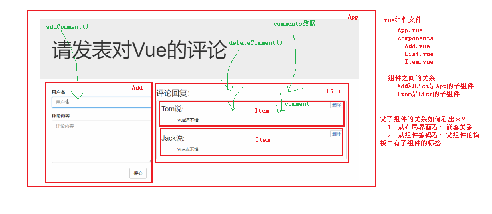
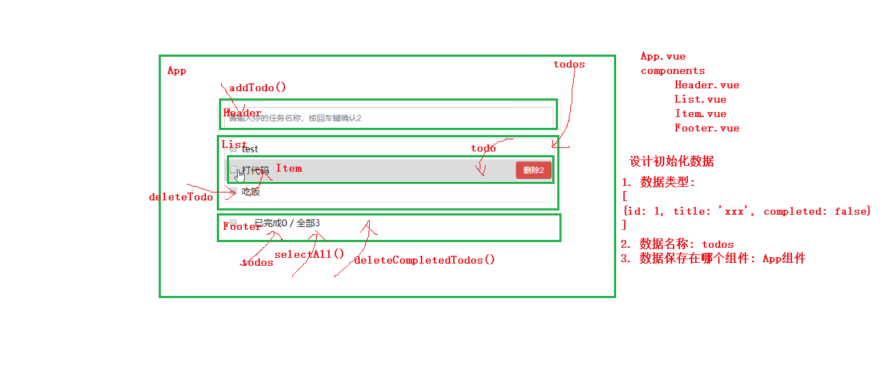

## 组件化编程的基本流程
	1). 拆分组件: 拆分界面, 定义/抽取组件
	2). 实现静态组件界面: 通过组件化(多组件)编码实现静态界面
	3). 实现动态组件界面:
		1). 初始化数据动态显示
		2). 交互(与用户)功能
			a. 添加
			b. 删除

## 设计组件的初始化数据的3个问题?
	1). 数据类型: [{id: Date.now(), username: 'xxx', content: 'good'}]
	2). 数据名称: comments
	3). 保存在哪个组件: 看数据是哪个组件需要(交给它), 还是哪些数组需要(交给共同父组件) App

## 父组件如何向子组件传递数据?
	1). 通过标签属性
	2). 父组件中给子组件标签指定属性: App中 <List :comments="comments"/>
	3). 子组件中声明接收标签属性: 接收的所有标签属性都会成为子组件对象的属性, 在模板中可以直接使用
	4). 子组件声明接收属性的方式
		方式一: 
			props: ['comments'], // 指定接收属性的属性名
		方式二:
			props: {
		      comments: Array  // 指定接收属性的属性名和属性值类型
		    }
		方式三:
			props: {
				sex: { // 指定属性的属性名/属性值的类型 / 默认属性值 / 是否必须的
			        type: Number,
			        default: 1, // 一般在不是必须时使用
			        required: true,  // 即使指定default值, 也必须传递标签属性
			    }
			}

## 组件标签名与属性名的大小问题
	基本规则: 写标签名或属性名时, 要么与定义的一样, 要么转小写中间用-连接
	1). 注册组件名与标签名: 
    注册名称        使用标签名
      add        ===> <add>    
      Add        ===> <Add> / <add>
      CommentAdd ===> <CommentAdd> / <comment-add>
      commentAdd ===> <commentAdd> / <comment-add>
      add-comment ===> <add-commend>
		原理: 如果完全一样直接匹配了, 否则将注册名称转换为小写中间用-连接与使用的标签比较如果完全相同才匹配
      add   ===> <Add>
      commentAdd  ===> <CommentAdd>
    注意: 组件标签写成小写时, 一定不能与html的标签名重名

	2). 注册属性名与标签属性名: 同理
		声明接收属性	     传递标签属性
      comments    ===>  comments
      Comments    ===>  Comments / comments    但会有警告建议声明名称写小写
      myComments  ===>  myComments / my-comments
      MyComments  ===>  MyComments / my-comments
		原理: 如果完全一样直接匹配了, 否则将声明的属性名转换为小写中间用-连接与使用的标签属性名比较如果完全相同才匹配
	  注意: 我建议大家写一样的, 但需要得看懂转小写的形式

## 组件中关于数据的2个重要问题
	1). 数据定义在哪个组件?
		看数据是哪个组件需要(交给它), 还是哪些数组需要(交给共同父组件) App
	2). 更新数据的函数方法定义在哪个组件?
		数据在哪个组件, 那更新数据的行为(函数/方法)就定义, 
		后面可能需要将这些函数传递给需要调用的后代组件
		后代组件不要直接更新父组件传递的数据, 而应该调用函数来更新

## 父组件向子组件标签传递属性的分类(根据属性值的类型分)
	1). 非函数属性(对象/数组/基本类型)
		例子: comments/Array , comment/Object, index/Number
		共同点: 都是将数据从父组件传递给子组件去显示
		注意: 子组件不要直接修改接收到的属性(props), 只是让你子组件去读取的
			如果子组件想要更新父组件的数据 ==> 父组件需要向子组件传递更新数据的函数, 子组件调用

	2). 函数属性
		例子: delteComment/Function, addComment/Function
		共同点: 子组件调用父组件传递的函数属性,  去更新父组件的数据
		最终效果: 实现了子组件向父组件传递数据
		区别函数与能显示的数据: 函数属性确实是从父组件传递给子组件, 但能显示的数据是从子组件传递给了父组件

## todos练习分析
