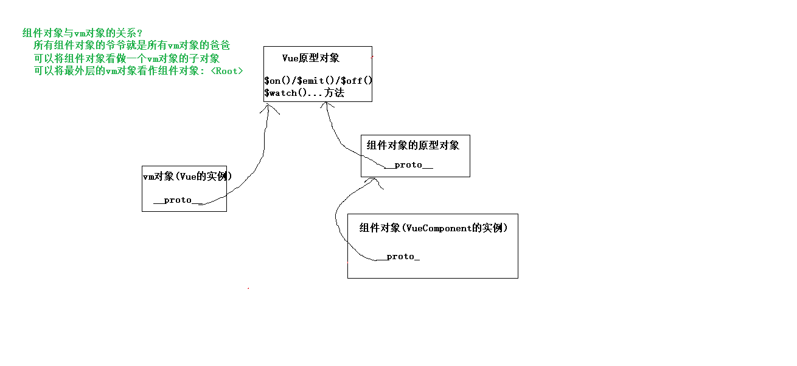
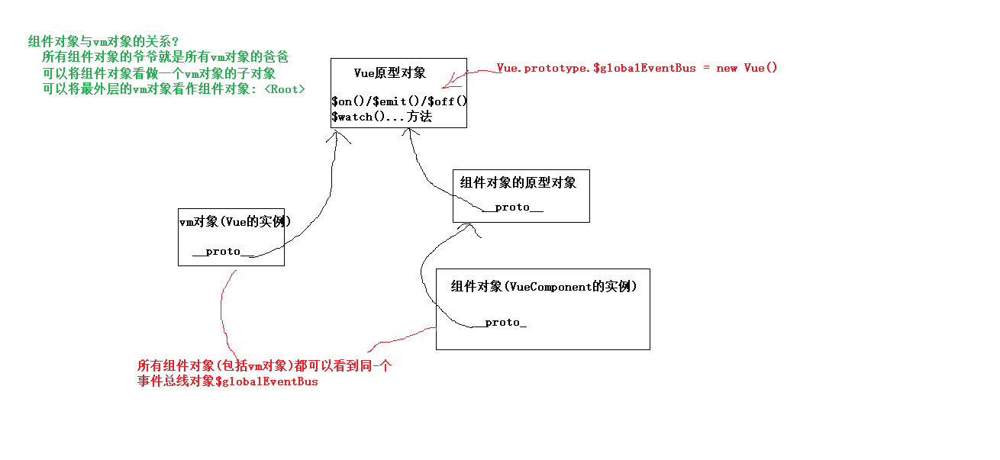
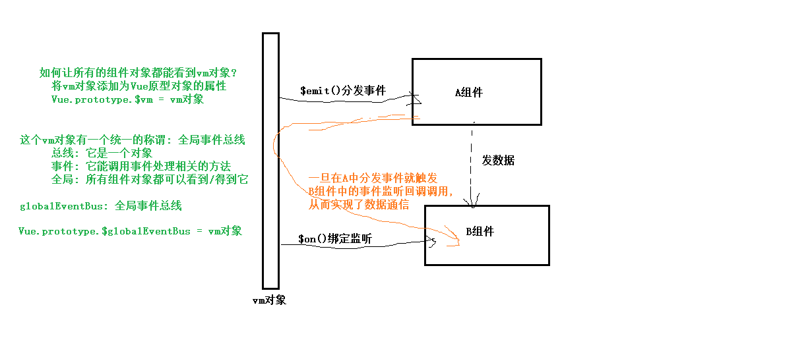

## todos应用功能
	1). 初始化数据的动态列表显示
	2). 添加todo
	3). 删除todo
	4). 勾选某个todo
	5). 显示全选/全不选, 完成数量/总数量, 清除已完成任务按钮
	6). 清除已完成任务
	7). 全选/全不选  --> computed属性的getter/setter
	8). 重新浏览 或者 重新打包浏览器访问, 还能看到之前最后的效果
		保存哪个数据?   todos
		数据保存在哪?   localStorage
		什么时候保存?   一旦todos内部发生任何变化都要保存  ==> 深度监视
		什么时候读取?   直接在data()读取返回

## localStorage: 浏览器本地数据存储
	是H5新提供的一种浏览器端保存数据的方式
	特点: 关闭浏览器数据不会自动清除, 刷新浏览器更不会
	使用: localStorage是window上的一个对象属性, 它有一些方法
		setItem('key标识名称', 'value数据'): 保存一个指定标称名称的数据
		const value = getItem('key标识名称'): 根据标识名称读取已保存的数据, 如果没有, 返回null
		removeItem('key标识名称'): 删除指定标识名称的一个local数据
		clear(): 清除所有保存的local数据

## 组件化编码的基本规范
	状态数据在哪个组件, 更新状态数据的行为函数就应该定义在哪个组件
	组件可以将自身的状态数据传递给子组件/后代组件
	子组件得到父组件传递过来数据后, 是用来做读取显示的, 而不应该去更新这个数据(语法上可以更新, 有效果)
	如果子组件需要更新父组件的状态数据: 不要直接更新, 而应该调用父组件的更新函数来更新父组件的状态数据

## 组件间通信

### 组件之间关系
	父子
	祖孙
	兄弟
	其它

### 组件间通信的方式
	props
	vue自定义事件
	全局事件总线
	slot
	vuex

### 通信方式一: props
	通过标签属性来实现父子组件间通信
		如果属性值是非函数(一般属性): 父==>子
		如果属性值是函数(函数属性): 子==>父
	什么情况下不方便(麻烦)
		祖孙组件间:  必须逐层传递
		兄弟组件间: 必须借助父组件

### 通信方式二: vue自定义事件
	用来实现子组件向父组件通信的方式
	在父组件中: 给子组件标签绑定自定义事件监听
		<Child @xxx="fn" />
		<Child ref="child">   mounted() {this.$refs.child.$on('xxx', this.fn)}
	在子组件中: 分发/触发自定义事件
	    this.$emit('xxx', data)  // data数据会自动传递给事件回调函数fn的形参
	它的功能与函数属性一致
	什么情况下不适合
		父向子通信: 不用
		祖孙组件间:  不用
		兄弟组件间: 不用
	组件对象的自定义事件相关语法:
		$on(eventName, callback)
		$once(eventName, callback)
		$emit(eventName, ...data)
		$off(eventName)

### 原生DOM事件与自定义事件理解
	理解原生DOM事件
		1). 绑定事件监听(需要我们手动编码)
		  事件名/类型: 事件的标识名称(有限的几个)
		  回调函数: 处理事件, 具体做什么得看初值功能(回调函数的数据参数是event对象)
		2). 分发(dispatch)/触发(emit)事件(浏览器自动处理, 我们只需要操作界面)
		  事件名: 用于与事件监听中的事件名进行匹配
		  数据: 相关信息数据(event对象), 数据对象会自动传递给监听回调函数

	理解自定义事件
    1). 绑定事件监听(需要我们手动编码)
        事件名/类型: 事件的标识名称(可以任意)
        回调函数: 处理事件, 具体做什么得看初值功能(回调函数的数据参数也是由我们指定)
    2). 分发(dispatch)/触发(emit)事件(浏览器不能自动处理, 我们编写对应的代码)
        事件名: 用于与事件监听中的事件名进行匹配
        数据: 如果需要传递数据, 就可以根据需求指定, 自动传递给事件监听回调函数的参数

### vm与组件对象的关系

### 通信方式三: 全局事件总线
    1.全局事件总线是任意关系的组件间通信(传值/数据)的解决方案
    2.全局事件总线是一个对象, 有事件处理的相关方法, 在vue中就是vm对象
    3.实现流程
        (1)将新创建的vm或最外层已有的vm作为总线对象保存到Vue的原型对象上
        (2)需要传值/数据的组件: 得到总线对象, 调用其$emit()分发事件, 携带数据
        (3)需要接收消息/数据的组件: 
            ①在mounted()中: 得到总线对象, 调用其$on()绑定监听, 接收数据
            ②在beforeDestroy()中: 得到总线对象, 调用其$off()解绑监听

### 通信方式四: 消息订阅(subscribe)与发布(publish)
    1.消息订阅与发布与全局事件总线一样都可以实现任意组件间通信
    2.但需要额外引入第三方实现库, 而全局事件总线不用, 一般在vue项目中不用
    3.实现流程
      (1)在接收数据的组件: 
        ①mounted(): 订阅消息, 在回调函数中接收数据并处理
        ②beforeDestroy(): 取消订阅
      (2)在发送数据的组件: 发布消息

### 通信方式五: slot/插槽
    1.当一个组件有不确定的结构时, 就需要使用slot技术了
    2.注意: 插槽内容是在父组件中编译后, 再传递给子组件
    3.如果决定结构的数据在父组件, 那用默认slot或命名命名slot
      (1)当只有一个不确定的结构时, 可以使用默认slot
      (2)当有多个不确定的结构时, 可以使用命名slot
    4.如果决定结构的数据在子组件, 那需要使用作用域slot