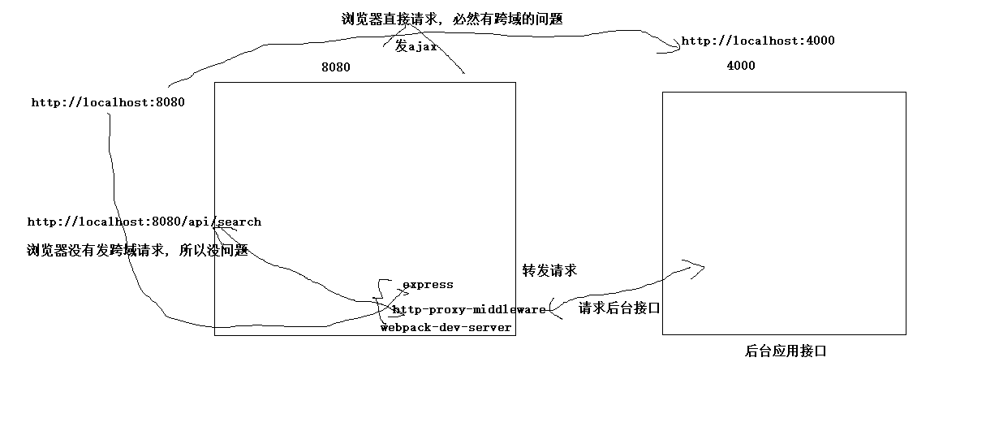

## ajax请求与后台交互
    1). 用什么发ajax请求?
        vue-resource: vue的插件, 主要用在vue1.x
        axios: 一个独立的专门用来发ajax请求的第三库, vuex2.x/react都推荐使用
    2). 什么时候发请求?
        mounted(): 在显示界面时, 希望尽快自动就能看到从后台返回的数据
        在事件回调函数或相关代码中: 在用户做了特定操作后, 才需要从后台获取数据显示

    3). 使用async/await来简化promise使用
        下载包: npm install -S @babel/polyfill
        配置: 
          entry: {
            xxx: ['@babel/polyfill', resolve('src/index.js')]
          },
    4). 解决ajax请求跨域的问题
        利用代理服务器解决
            1)利用webpack-dev-server作为代理服务器对请求进行代理转发
            2)webpack-dev-server内部利用http-proxy-middle包对特定请求进行转发操作
        配置:
            proxy: {
              // 处理以/api开头路径的请求
              // '/api': 'http://localhost:4000'
              // http://localhost:4000/api/search/users   
              '/api': {
                target: 'http://localhost:4000', // 转发的目标地址(服务器接口地址)
                pathRewrite: {
                  '^/api': ''  // 转发请求时去除路径前面的/api     ==> http://localhost:4000/search/users
                },
                changeOrigin: true, // 支持跨域, 如果协议/主机也不相同, 必须加上
              }
            },
        注意: 编码发请求时一定要请求当前项目的基础路径
